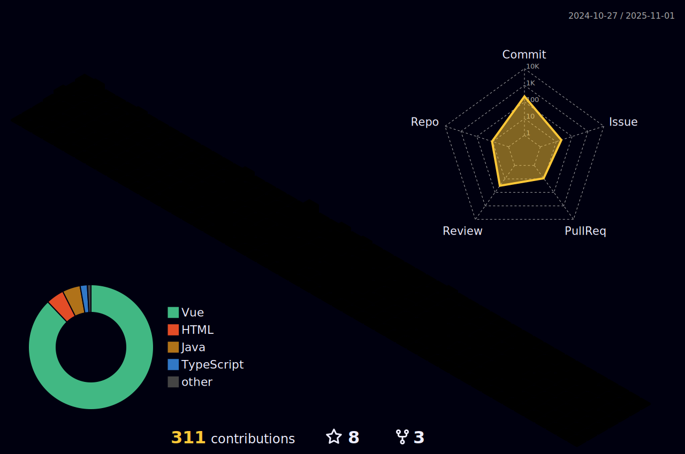

🏆 I'm the main contributor to a project of the Google Summer of Code 24 Scholarship Winner!

💻 Hi there! I’m a seasoned full-stack developer with strong expertise in:
- Front-End: React, Vue.js, Angular, Vuetify
- Skills: React.js, Vue.js, TypeScript, JavaScript, HTML, CSS
- Design Systems: Bootstrap, Material Design
- APIs: RESTful, Google Maps, Google Calendar
- Specializations: Third-party integrations (Google Cloud, Firebase, Firestore), PDF generation, Chart.js

⚙️ My front-end expertise includes:
- Dynamic UI Development: Creating responsive interfaces with React.js, Vue.js, and Angular.
- Styling & Design: Mastery of HTML5, CSS3, SCSS, Bootstrap, Vuetify, Material Design.

🔧 Backend Development Proficiency:
- Frameworks: Node.js, Express, Laravel, Java
- Databases:  SQL, Firestore
- Libraries: JWT, Nodemailer, CORS
- Cloud Solutions: Google Cloud, Firebase

📧 Email: [joaofranzoni0@gmail.com]
🔗 LinkedIn: [https://www.linkedin.com/in/joão-franzoni/] 

